In its July 31, 2025, revised report, the U.S. Bureau of Labor Statistics (BLS) noted a sharp slowdown in job growth since May, raising concerns about the labor market’s health. Persistent disparities in unemployment rates remain tied to race and industry, with recent college graduates particularly hard hit. For ages 22–27, unemployment climbed to 5.5–7.1% in early 2025, well above the national average of 4.1–4.2%. This project applies causal inference methods to examine how race, industry, recent graduate status, and their interactions contribute to unemployment disparities, using BLS historical labor force statistics and survey data from recent months.

## Data

We are using below two sources of datasets released by BSL —\
[2015–2025 monthly aggregated unemployment rates by demographics](https://www.bls.gov/cps/tables.htm)\
[2024–2025 monthly labor force survey data](https://www2.census.gov/programs-surveys/cps/datasets/)\
Below is a snippet of the two datasets

::: {#fig-labor-data layout-ncol=2}

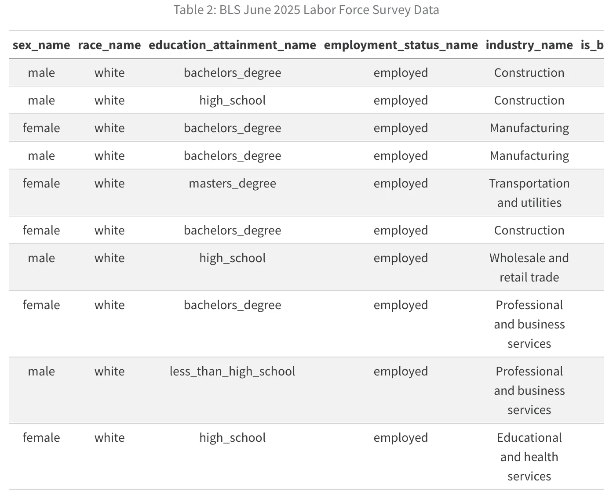

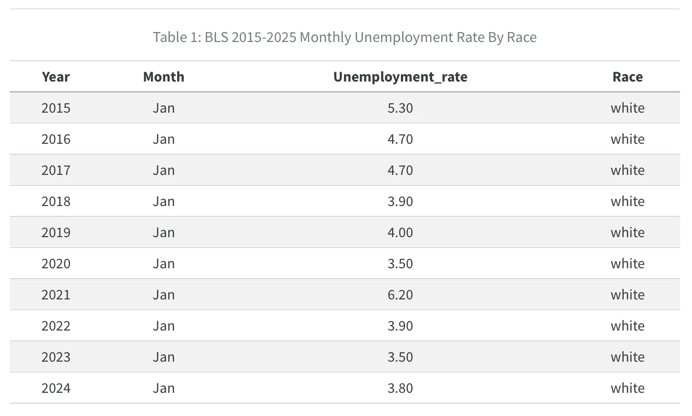

Labor Market Survey Figures

:::

::: {style="text-align: center; letter-spacing: 0.5em; margin: 2em 0; font-weight: bold;"}

. . .

:::

## EDA

### Unemployment Rates by races

::: {#fig-unemployment-rate-by-races}

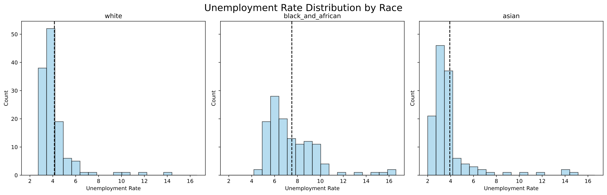{width=75%}

Unemployment Rates By Races

:::

### Unemployment Rates by industries

By overlaying the smooth PDF curve on top of original data’s histogram, we can visualize that the three distributions all match the distribution of the actual data. The peaks of the PDFs align with the peak of the histogram. The spread of the PDFs roughly match the spread of the data, including the tail. Now we need to use Kolmogorov-Smirnov Test to test Goodness-of-fit with the original data and estimated parameters, then examine the p value.

::: {#fig-unemployment-rate-industry}

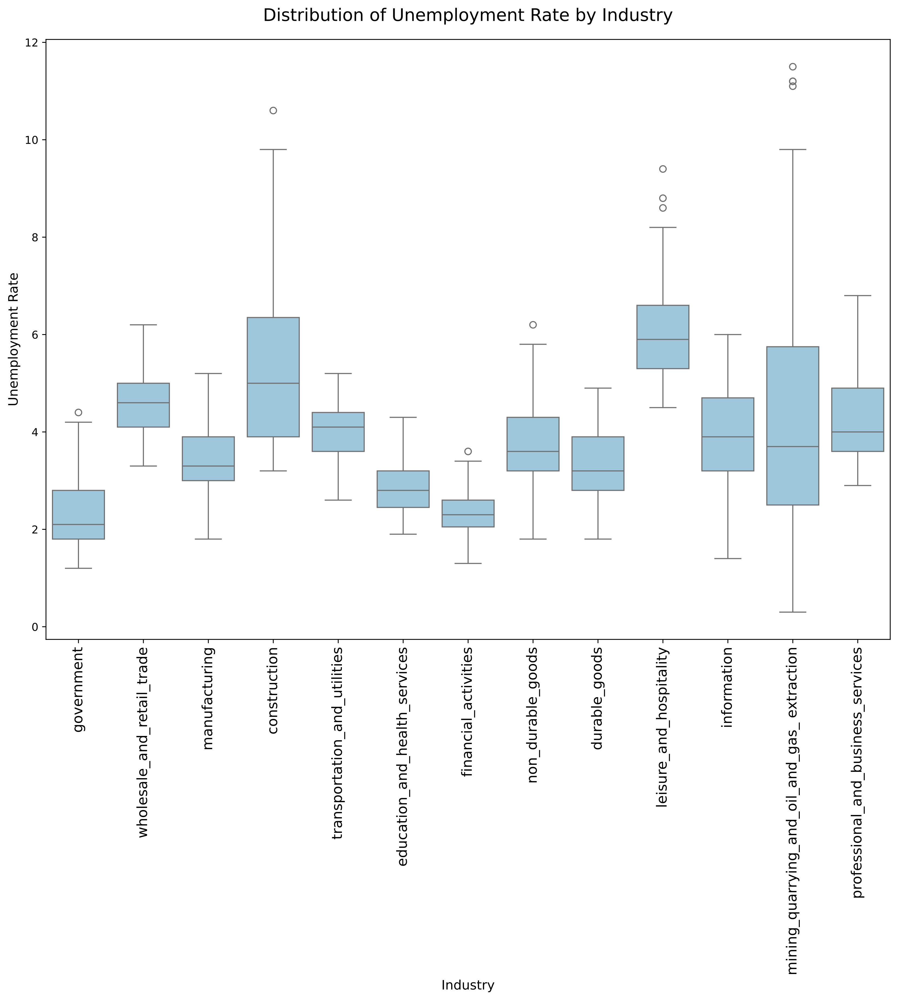{width=75%}

Unemployment Rates By Industries

:::

### Unemployment Rates by age

::: {#fig-unemployment-rate-age}

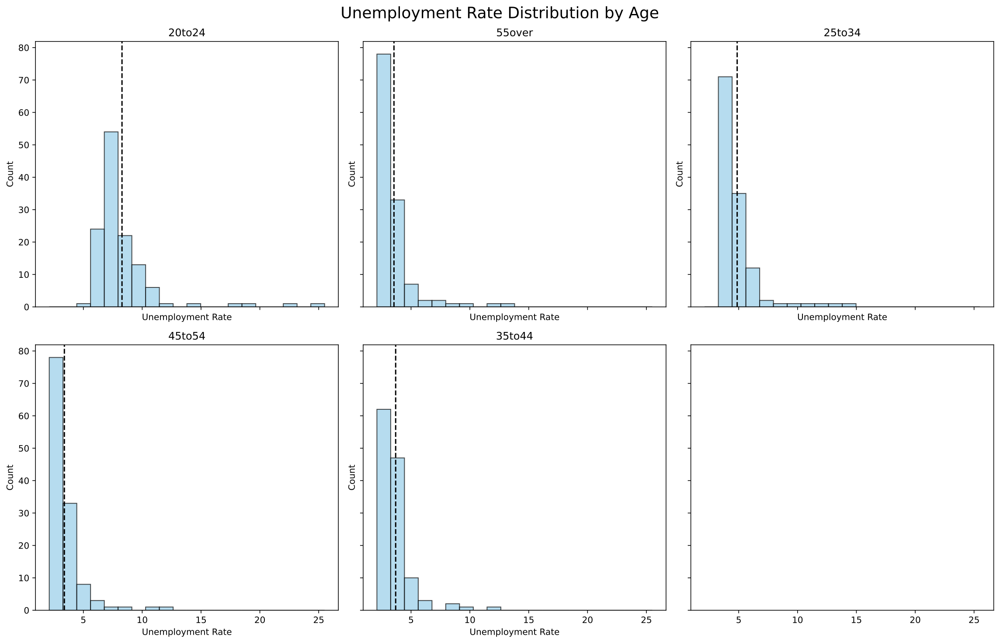{width=75%}

Unemployment Rates By Ages

:::

EDA result shows that Black population experienced the highest average unemployment rate (7.5%), primarily within the 5–10% range, compared with White and Asian. Among industries, Leisure and Hospitality recorded the highest unemployment (10%) with a long-tail distribution, followed by Construction and Mining/Oil & Gas, exhibiting similar but marginally lower patterns (Agriculture is excluded from the scope of this project due to high seasonal variations). Financial Activities show the lowest and most stable unemployment, consistently under 5%. Black Americans and those employed in Leisure, Construction, or Mining sectors are disproportionately affected by higher unemployment.

::: {style="text-align: center; letter-spacing: 0.5em; margin: 2em 0; font-weight: bold;"}

. . .

:::

## PGM

### Race Model

#### 1. Build baseline unemployment rate distribution

Let’s first build employment rate distribution plot using 2015–2025 BLS monthly data to explore which distribution model the data fits the best.

::: {#fig-population-unemployment-rate}

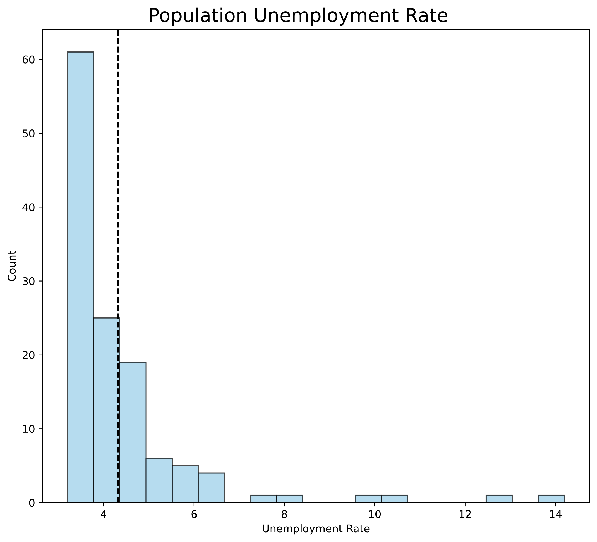{width=75%}

Overall Population Unemployment Rate Distributions (2015–2025 statistics)

:::

Figure 5 illustrates that the population unemployment rate is right-skewed model, suggesting that the Log-Normal distribution, Gamma distribution and Weibull distribution can be appropriate models. We are going to estimate and examine the parameters of these distributions, and test goodness-of-fits with p-values.

::: {#fig-dist layout-ncol=3}

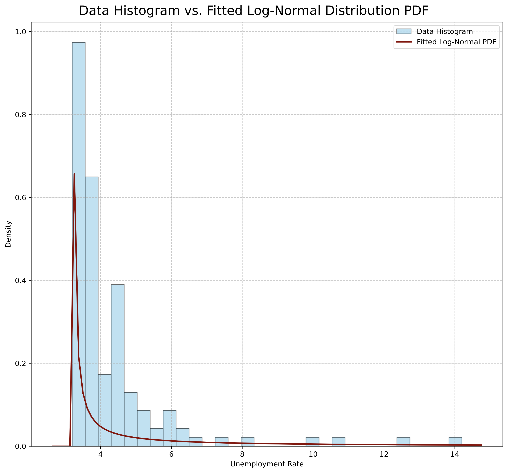

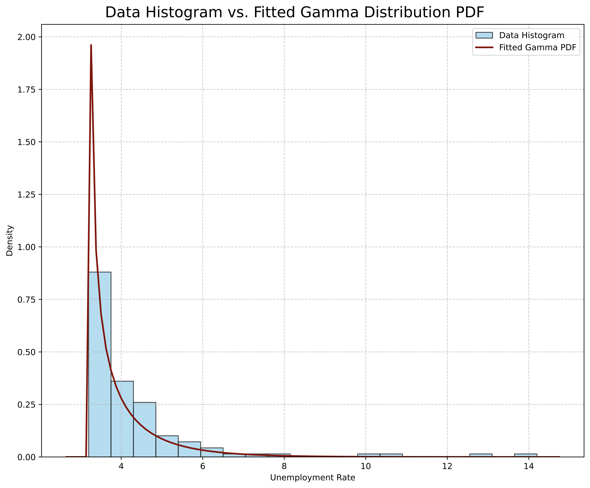

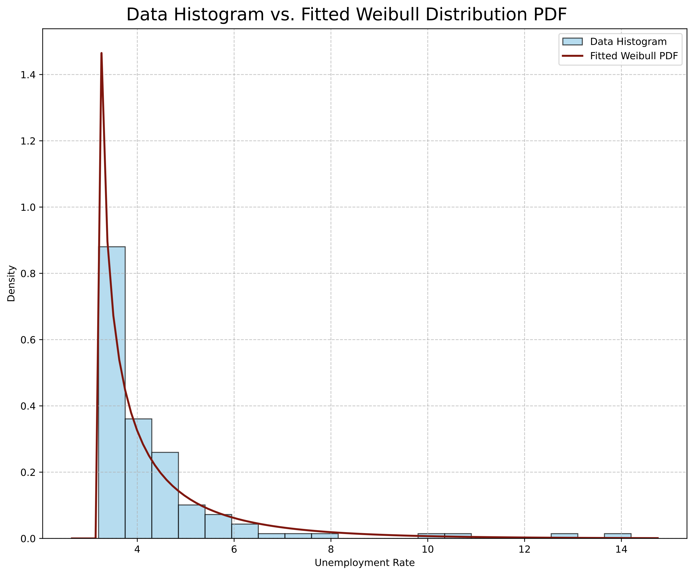

Unemployment Rate Histogram vs. Fitted Distributions

:::

By overlaying the smooth PDF curve on top of original data’s histogram, we can visualize that the three distributions all match the distribution of the actual data. The peaks of the PDFs align with the peak of the histogram. The spread of the PDFs roughly match the spread of the data, including the tail. Now we need to use Kolmogorov-Smirnov Test to test Goodness-of-fit with the original data and estimated parameters, then examine the p value.

::: {#fig-distributions-parameters}

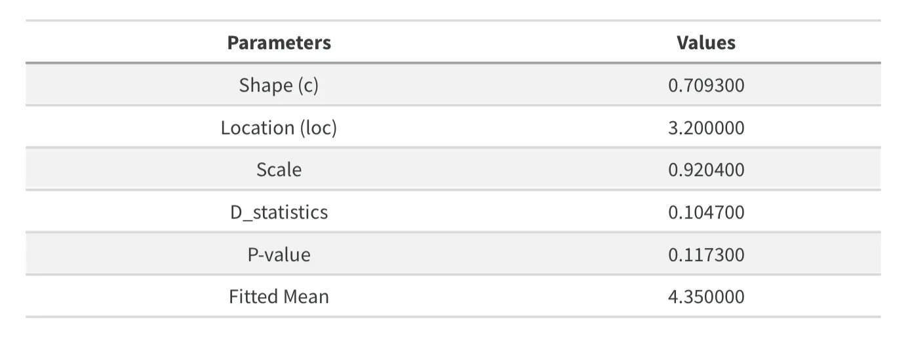{width=75%}

Estimated parameters and p-values of Log-Norm and Gamma distributions

:::

The results of the Weibull distribution, summarized in Table 1, including the shape, location, and scale parameters, along with the D-statistic, P-value, and fitted mean proves Weibull distribution is a good fit, supported by a KS test p-value of 0.1173 (greater than 0.05). The estimated parameters (c=0.7093, loc=3.2000, scale=0.9204) align well with the spread of the data. Shape (c<1): Confirms the strong right-skewness of the data. Location (loc=3.2000): Indicates the distribution starts around 3.20, matching data’s lower bound. Inferred Mean: The calculated mean of approximately 4.35 from these parameters is close but slightly higher than the data’s actual mean of around 4, showing a good capture of central tendency.

#### 2. Define the prior means for overall population
```{python}
#| eval: false
#| column: page
# population unemployment mean probability from the fitted Weibull distribution
weibull_fitted_mean_prob = 0.0435
# Convert the fitted mean probability to its log-odds equivalent in order to model
# binary outcome with logistic regression
population_mean_log_odds = np.log(weibull_fitted_mean_prob / (1 - weibull_fitted_mean_prob))
print(f"population mean log-odds: {population_mean_log_odds:.4f}")
```
population mean log-odds: $-3.0905$

#### 3. Define the prior means by races
```{python}
#| eval: false
#| column: page
# Function to find the means of different demographics
def mean_prob_demographic(df_name, demographic_type, demographic_description):
    demographic_mean_prob = df_dic[df_name].loc[
      df_dic[df_name][demographic_type]==demographic_description
      ]['Unemployment_rate'].mean()/100
    demographic_mean_log_odds = np.log(demographic_mean_prob / (1 - demographic_mean_prob))
    # beta_effect is the difference between the demographic group mean log-odds and the population mean log-odds
    beta_effect = demographic_mean_log_odds - population_mean_log_odds
    return beta_effect

# Create a grid of demographic information to return the means
demographic_grid = pd.DataFrame({
    "df_name":[
        'Race',
        'Race',
        'Race'
    ],
    "demographic_type":[
        "Race",
        "Race",
        "Race"
    ],
    "demographic_description":[
        'black_and_african',
        'white',
        'asian'
    ]
})
# Return the beta_effect of different demographics
demographic_grid['beta_effect']= np.float64(0)
for row in range(0,len(demographic_grid)):
    # Mean of demographic groups
    beta_effect = mean_prob_demographic(
      demographic_grid['df_name'][row],
      demographic_grid['demographic_type'][row],
      demographic_grid['demographic_description'][row]
      )
demographic_grid['beta_effect'][row] = beta_effect

display(demographic_grid)
```

::: {#fig-beta-parameters}

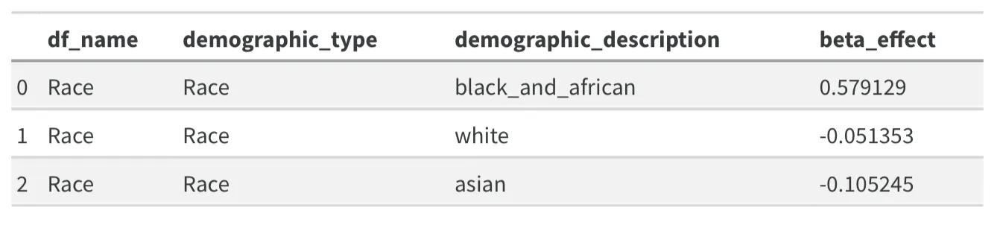{width=75%}

Beta parameters of races

:::

The corresponding beta_effect for each of three races are shown in table above. These beta parameters are additive race effect parameter on population mean.

#### 4. Define PyMC model
```{python}
#| eval: false
#| column: page
# Train-test split
from sklearn.model_selection import train_test_split
train_df_survey, test_df_survey = train_test_split(
  df_survey_jun_jul,
  test_size=0.2,
  random_state=42)

# Create the pymc model
import pymc as pm
import arviz as az

X_train = train_df_survey[['is_black_african','is_asian', 'is_white']]
y_train = train_df_survey['unemployment_status']

X_test = test_df_survey[['is_black_african','is_asian', 'is_white']]
y_test = test_df_survey['unemployment_status']

train_coords = {
    'response_id': X_train.index.values
}

with pm.Model(coords=train_coords) as unemployment_race_model:
    # Prior of population mean log odds
    mu_population_log_odds = pm.Normal('mu_population_log_odds', mu=population_mean_log_odds, sigma=0.5)

    # Additive race effect parameter on population mean
    beta_black = pm.Normal(
      'beta_black',
      mu=demographic_grid[
        demographic_grid['demographic_description']=='black_and_african']['beta_effect'], sigma=0.3)
        # Can be positive or negative

    beta_asian = pm.Normal(
      'beta_asian',
      mu=demographic_grid[demographic_grid['demographic_description']=='asian']['beta_effect'], sigma=0.3)

    beta_white = pm.Normal(
      'beta_white',
      mu=demographic_grid[demographic_grid['demographic_description']=='white']['beta_effect'], sigma=0.3)

    black_obs = pm.Data("black_obs", X_train['is_black_african'], dims="response_id")
    white_obs = pm.Data("white_obs", X_train['is_white'], dims="response_id")
    asian_obs = pm.Data("asian_obs", X_train['is_asian'], dims="response_id")

    p_unemployment = pm.Deterministic(
      "p_unemployment",
      pm.math.invlogit(mu_population_log_odds + beta_black * black_obs + beta_white * white_obs
      + beta_asian * asian_obs), dims = 'response_id')

    unemployment_obs = pm.Data("unemployment_obs", y_train, dims="response_id")
```

#### 5. Graph the PGM

::: {#fig-race-model-pgm}

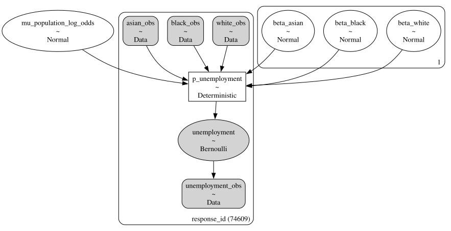{width=75%}

Race Model PGM

:::

#### 6. Estimate model parameters

```{python}
#| eval: false
#| column: page
print("Starting Race Model Sampling...")
with unemployment_race_model:
    race_idata = pm.sample(tune =500, draw = 500, random_seed=5650)
race_idata.posterior.mean(dim=['chain','draw']).data_vars
Press enter or click to view image in full size
```

::: {#fig-estimated-posterior-model-parameters}

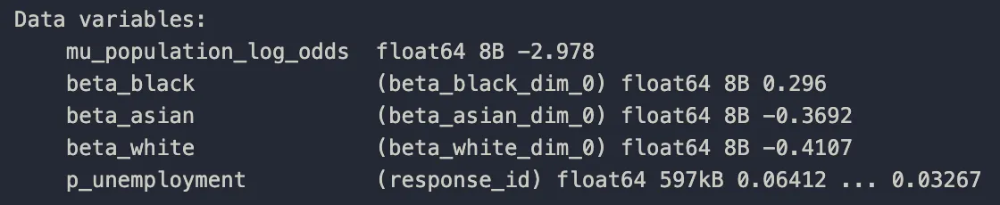{width=75%}

Estimated posterior model parameters

:::

#### 7. Extract predictive posterior distribution and predict unemployment rates on test data

```{python}
#| eval: false
#| column: page
# Update to test data
test_coords = {
    'response_id': X_test.index.values
}
with unemployment_race_model:
    pm.set_data({"unemployment_obs": y_test,
                 "black_obs": X_test['is_black_african'],
                 "white_obs": X_test['is_white'],
                 "asian_obs": X_test['is_asian']}, coords=test_coords)
with unemployment_race_model:
    race_idata = pm.sample_posterior_predictive(race_idata, random_seed=5650)
```

::: {#fig-predictive-unemployment-rate-vs-true-races}

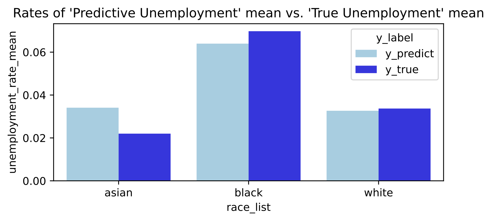{width=75%}

Bar Plot — Predictive Unemployment Rate vs. True Rate By Races

:::

The bar plot above demonstrates that the PGM race model predicts unemployment rates well. It accurately captures the highest unemployment rate for the Black race, closely matching the survey data. However, the model tends to overestimate the unemployment rate for the Asian group compared to the observed values.

### Industry Model

#### 1. Define the industry model

We are using the Adaptive-Pooling approach, starting with the No-Pooling estimate as a prior for a given industry, then moving towards the Full-Pooling estimate with data observed for individuals in industry.
```{python}
#| eval: false
#| column: page
# Train-test split
from sklearn.model_selection import train_test_split
train_df_industry_survey, test_df_industry_survey = train_test_split(
  survey_df_industry, test_size=0.2, random_state=42)

# Define the PGM model with train data
coords = {"industry": industry_names}
with pm.Model(coords=coords) as unemployment_industry_model:
    industry_idx_obs = pm.Data("industry_idx_obs", X_train_ind['industry_idx'], dims="obs_id")
    # Global Priors
    sigma = pm.Exponential("sigma", 1) # standard deviation for alpha_industry
    # Industry-Specific Parameters - observed industry means
    mu_alpha_industry = pm.Data("mu_alpha_industry", prior_mu_alpha_vals, dims="industry")
    # history industry means
    alpha_industry = pm.Normal("alpha_industry",
                                mu=mu_alpha_industry, # historical industry means distribution
                                sigma=sigma,
                                dims="industry")
    # Probability of unemployment of each industry determined by alpha_industry
    p_unemployment = pm.Deterministic(
      "p_unemployment",
      pm.math.invlogit(alpha_industry[industry_idx_obs]), dims='obs_id')
    unemployment_obs = pm.Data("unemployment_obs", y_train_ind, dims="obs_id")
    # Observed data - unemployment status
    unemployment = pm.Bernoulli(
      "unemployment",
      p=p_unemployment,
      observed=unemployment_obs, dims="obs_id")
```

#### 2. Graph the PGM

::: {#fig-industry-model-pgm}

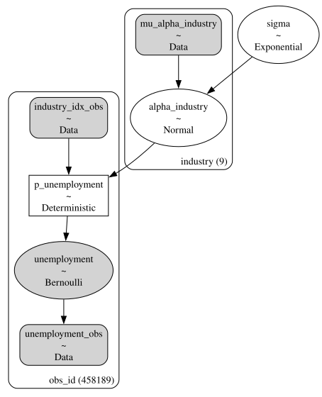{width=75%}

Industry Model PGM

:::

#### 3. Estimate model parameters

We are using the train data to extract the posterior means of unemployment rates by industries. Figure10 shows similar results as what we observed from the BLS monthly unemployment rates statistics that Leisure and Hospitality has the highest unemployment rates while Finance and Public Administration industries have lowest unemployment rates.

::: {#fig-industry-pgm-scatter}

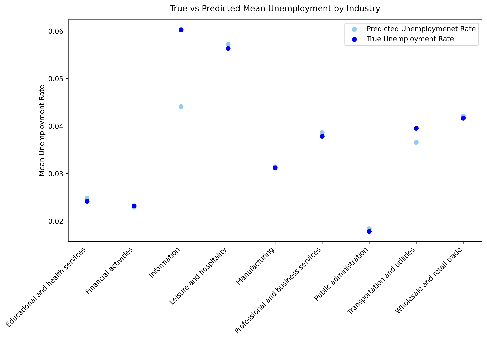{width=75%}

Estimated Industry-Specific Unemployment Rate (Adaptive Pooliing)

:::

#### 4. Extract Posterior Predictive unemployment rates on test data
```{python}
#| eval: false
#| column: page
# Extract means of unemployment values from the posterior predictive distribution given test data
industry_test_meanunemployment =
industry_test_idata.posterior_predictive['unemployment'].mean(dim=['chain','draw'])

# Add the predictive posterior means to the test dataframe
ind_rate_df = test_df_industry_survey[['industry_name','unemployment_status']]
ind_rate_df['unemployment_mean_pred'] = industry_test_meanunemployment
ind_rate_df = ind_rate_df.groupby('industry_name').agg(
    unemployment_mean_true = ('unemployment_status','mean'),
)
```

::: {#fig-unemployment-means-by-industries}

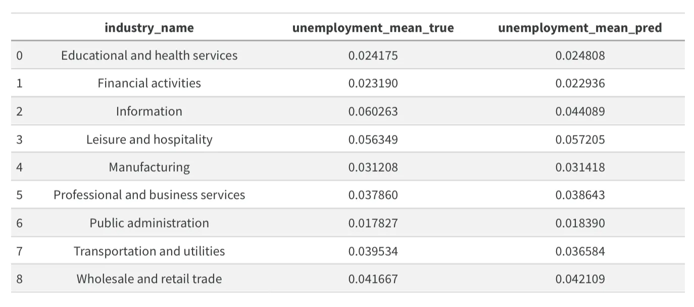{width=75%}

Predicted vs. True Unemployment Means By Industries

:::

#### 5. Compare predictive vs. true unemployment rate by industries

```{python}
#| eval: false
#| column: page
# Scatter plot
x = np.arange(len(ind_rate_df))
fig, ax = plt.subplots(figsize = (10, 7))
ax.scatter(
    x,
    ind_rate_df['unemployment_mean_pred'],
    color = 'skyblue',
    label = 'Predicted Unemploymenet Rate'
)

ax.scatter(
    x,
    ind_rate_df['unemployment_mean_true'],
    color='blue',
    label = 'True Unemployment Rate'
)
ax.set_xticks(x)
ax.set_xticklabels(ind_rate_df['industry_name'],rotation=45, ha="right")

ax.set_ylabel("Mean Unemployment Rate")
ax.set_title("True vs Predicted Mean Unemployment by Industry", y = 1.02)
ax.legend()

plt.tight_layout()
```

::: {#fig-unemployment-rate-scatter}

{width=75%}

Predicted vs. True Unemployment Means By Industries

:::

The scatter plot (Figure 15) compares true and predicted unemployment rates for each industry. Most industries show close alignment between the two measures, indicating good predictive accuracy. Alghouth Leisure and hospitality and Information show slightly higher gaps, suggesting the model under- or overestimates unemployment rates. Industries such as Leisure and hospitality and Information exhibit the highest unemployment rates, both in true and predicted values. In contrast, Public administration and Educational and health services have the lowest unemployment rates, which is same as what is observed from the historical data.

### Recent graduates — Education attainment model

Finally, we are analyzing the difference of the unemployment between recent graduates and non recent graduates, and its interactive effect with education_attainment

#### 1. Define the recent graduates — education attainment model

```{python}
#| eval: false
#| column: page
# train-test split
train_df_age_education, test_df_age_education = train_test_split(
  survey_df_age_education,
  test_size=0.2,
  random_state = 5650)
X_train_ae = train_df_age_education[
  ['is_bachelors', 'is_masters', 'is_lower_than_bachelors','is_recent_graduate']]
y_train_ae = train_df_age_education['unemployment_status']
X_test_ae = test_df_age_education[
  ['is_bachelors', 'is_masters', 'is_lower_than_bachelors', 'is_recent_graduate']]
y_test_ae = test_df_age_education['unemployment_status']

# Define the model
coords = {'response_id': X_train_ae.index.values}
with pm.Model(coords=coords) as age_education_model:
    # obsereved data
    recent_graduate_obs = pm.Data(
      "recent_graduate_obs",
      X_train_ae['is_recent_graduate'],
      dims="response_id")

    bachelors_obs = pm.Data(
      'is_bachelors_obs',
      X_train_ae['is_bachelors'],
      dims='response_id')

    masters_obs = pm.Data(
      'is_masters_obs',
      X_train_ae['is_masters'],
      dims='response_id')

    # Prior of population mean log odds
    mu_population_log_odds = pm.Normal(
      'mu_population_log_odds',
       mu=population_mean_log_odds,
       sigma=0.5)

    # Beta of degrees and recent_graduate variables
    beta_master = pm.Normal("beta_master", 0, 1)
    beta_bachelor = pm.Normal("beta_bachelor", 0, 1)
    beta_recent_graduate = pm.Normal("beta_recent_graduate", 0, 1)
    beta_recent_graduate_bachelor = pm.Normal("beta_recent_graduate_bachelor", 0, 1)
    beta_recent_graduate_master = pm.Normal("beta_recent_graduate_master", 0, 1)

    # p_unemployment determined by variables
    p_unemployment = pm.Deterministic(
      "p_sayhire",
      pm.math.invlogit(
        mu_population_log_odds +
        beta_bachelor * bachelors_obs +
        beta_master * masters_obs +
        beta_recent_graduate * recent_graduate_obs +
        beta_recent_graduate_bachelor * recent_graduate_obs * bachelors_obs +
        beta_recent_graduate_master * masters_obs * recent_graduate_obs ),
        dims = 'response_id')
    # unemployment
    unemployment_obs = pm.Data(
      "unemployment_obs",
      y_train_ae,
      dims="response_id")
    unemployment = pm.Bernoulli(
      "unemployment",
      p = p_unemployment,
      observed=unemployment_obs,
      dims="response_id")
```

#### 2. Graph the PGM

::: {#fig-pgm-recent-graduates}

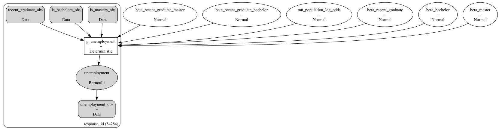{width=75%}

PGM of recent graduates — education attainment model

:::

#### 3. Estimate model parameters with training data

::: {#fig-pgm-model-paramters-estimate-output}

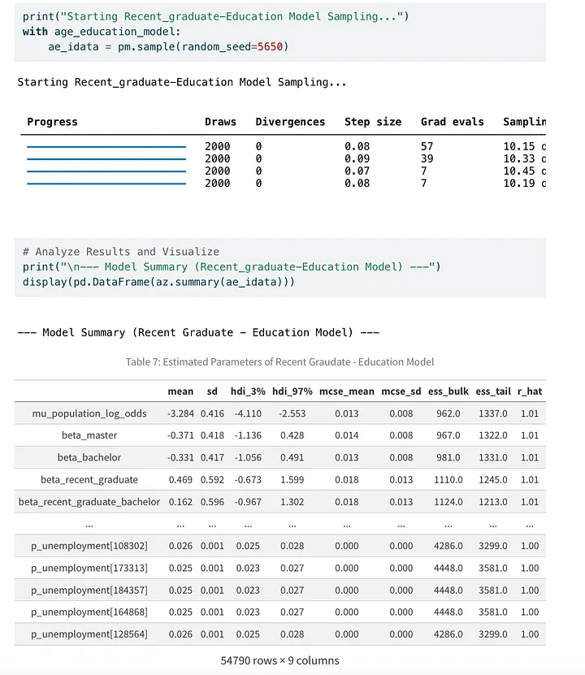{width=75%}

Output of estimate model parameters with training data

:::

#### 4. Extract Posterior Predictive Distribution on test data

```{python}
#| eval: false
#| column: page
# Update to test data
test_coords = {
    'response_id': X_test_ae.index.values
}
with age_education_model:
    pm.set_data({"unemployment_obs": y_test_ae,
                 "is_bachelors_obs": X_test_ae['is_bachelors'],
                 "is_masters_obs": X_test_ae['is_masters'],
                 "recent_graduate_obs": X_test_ae['is_recent_graduate']},
                 coords=test_coords)

with age_education_model:
    ae_test_idata = pm.sample_posterior_predictive(ae_idata, random_seed=5650)
```

#### 5. Plot predictive vs. unemployment rate in the test data

::: {#fig-bar-predictive-unemployment-rate}

{width=75%}

Bar Plot — Predictive Unemployment Mean Rate vs. True Mean Rate By Recent Graduate and Education Level

:::

The bar plot above (Figure18) shows that the model predicts unemployment rates for individuals in the labor force with a Bachelor’s degree as their highest educational attainment quite accurately, with recent graduates (aged 22–25) exhibiting notably higher unemployment than non-recent graduates. For individuals with a Master’s degree, the model performs well for non-recent graduates but shows a larger gap in predictions for recent graduates, likely due to limited training data. Nevertheless, the model captures the real-world trend that recent graduates face greater challenges in the job market compared to older cohorts.

::: {style="text-align: center; letter-spacing: 0.5em; margin: 2em 0; font-weight: bold;"}

. . .

:::

## References

Joseph Dean, Estee Smith. 2024. “Gender Differences in Unemployment Trends: Race, Jobs and the Economy Update for February 2024.” NCRC, March.

TOIEducation. 2025. “Degrees at Risk: 10 US College Majors with the Highest Unemployment Rate in 2025.” The Times Of India, July.

“US UNEMPLOYMENT RATE BY INDUSTRY (2024).” 2024. Oberlo.

Wilson, Valerie, and William Darity-Jr. 2022. “Understanding Black-White Disparities in Labor Market Outcomes Requires Models That Account for Persistent Discrimination and Unequal Bargaining Power.” Economic Policy Institute, March.
