"Buy Now, Pay Later" (BNPL) services are advertised as sleek financial tools, but who actually relies on them—and who defaults? My team and I used Federal Reserve survey data from 2021–2024 to predict BNPL adoption and delinquency. Benchmarking Logistic Regression, SVM, XGBoost, and Neural Networks, we found that usage is fundamentally driven by structural financial vulnerability and liquidity constraints rather than simple preference. Beyond traditional credit markers, our analysis uncovered a striking, less-recognized trend: a powerful connection between household caregiving demands and BNPL dependency, particularly among mothers with multiple children. Read on to see how our models performed and what they reveal about systemic financial insecurity.

## Overview

This analysis utilizes data from the Federal Reserve’s Survey of Household Economics and Decisionmaking (SHED) for the years 2022–2025 to model the adoption and delinquency patterns of Buy Now, Pay Later (BNPL) users.

**Target Variables:**
 - BNPL Adoption: Derived from question BNPL1 ("In the past year, have you used a “Buy Now, Pay Later” service to buy something?")
 - BNPL Delinquency: Derived from question BNPL3 ("In the past year, have you ever been late making a payment for something you bought using a Buy Now, Pay Later service?")

**Predictive Features:**
The model relies on self-reported features across several financial and demographic dimensions:
 - Financial Well-being: Economic status, financial concerns, emergency fund availability, and savings behaviors.
 - Credit & Payment Habits: General payment behavior and credit card utilization.
Socio-demographics: Race, educational attainment, total household assets, and number of children under 18."

## Data

The analysis uses data from the following sources:

https://www.federalreserve.gov/consumerscommunities/shed_data.htm

- **Dataset 1**: 2022 Survey Data csv file
- **Dataset 2**: 2023 Survey Data cvs file
- **Dataset 2**: 2024 Survey Data cvs file
- **Dataset 2**: 2025 Survey Data cvs file

Due to inconsistencies in survey IDs and answers across the four years, data processing was performed to synchronize and merge the datasets. Separate models were built that only include 2025 data due to the survey questions that only exist in 2025 data.

## Data pre-processing

The data preprocessing workflow focused on consolidating multiple yearly survey waves (2022–2025) into a unified analytical dataset and standardizing variable definitions across time. To manage the vast number of survey items, I filtered the data to retain only the most relevant questions and excluded unrelated variables prior to the merge. The finalized subset includes:

| Variable name | Description |
|---|---|
| A6 | If you were to apply for a credit card today, how confident are you that your application would be approved? |
| B3 | Compared to 12 months ago, would you say that you (and your family) are better off, the same, or worse off financially? |
| BNPL1 | In the past year, have you used a “Buy Now Pay Later” service to buy something? |
| BNPL3 | In the past year, have you ever been late making a payment for something you bought using a Buy Now Pay Later service? |
| C4A |In the past 12 months, how frequently have you carried an unpaid balance on one or more of your credit cards? |
| EF1 | Have you set aside emergency or rainy day funds that would cover your expenses for 3 months in case of sickness, job loss, economic downturn, or other emergencies? |
| I20 | In the past month, would you say that your and your spouse’s or partner’s total spending was more or less than your income? |
| L0C | How many children do you have who are under age 18 and currently live with you? |
| ppage | Age (discrete number of years) |
| ppethm | Race |
| ppeducat | What is your highest level of eductation? |
| ppemploy | Current employment status |
| ppfsasset | What is the approximate total amount of your household's savings and investments? |
| ppfs1482 | Where do you think your credit score falls? |
| pphhsize | Household size |
| ppinc7 | Total household income (categorical, e.g. $10K-$24,999, $25K-$34,999) |
| ppmarit5 | Marital status |
| EF5C | Other than any credit card bills you may have, did you pay all your bills in full last month? |
| C3P | Last month, how did you handle your credit card bills? |
| K21_a | Do you currently have Retirement savings account, such as a 401(k) plan through an employer, IRA or Roth IRA |
| INF4 | Overall, have changes in the prices you pay compared to last year made your financial situation worse, better, or had little to no effect? |
| BNPL1A | In the past year, did any of your BNPL payments trigger an overdraft or non-sufficient-funds (NSF) fee on your bank account? |
| BNPL5 | Thinking about the most recent time you used a Buy Now Pay Later service, which of the following was the most important reason why you chose to finance the purchase in this way? |
| EF5D | Did you have any bills that you had difficulty paying last month? |
| EF3_a | How to pay $400 emergency expense? - Put it on my credit card and pay it off in full at the next statement |
| EF3_b | How to pay $400 emergency expense? - Put it on my credit card and pay it off over time |
| EF3_c | How to pay $400 emergency expense? - With the money currently in my checking/savings account or with cash |
| EF3_d | How to pay $400 emergency expense?  - Using money from a bank loan or line of credit |
| EF3_e | How to pay $400 emergency expense? - By borrowing from a friend or family member |
| EF3_f | How to pay $400 emergency expense? - Using a payday loan, deposit advance, or overdraft |
| EF3_g | How to pay $400 emergency expense? - By selling something |
| EF3_h | How to pay $400 emergency expense? - I wouldn't be able to pay for the expense right now |
| X12_a | Financial challenge? - Finding or keeping a job |
| X12_b | Financial challenge?  - Increases in prices for things you buy |
| X12_c | Financial challenge? - Housing costs or availability |
| X12_d | Financial challenge? - Retirement savings |
| X12_e | Financial challenge? - Making ends meet |
| X12_f | Financial challenge? - Medical debt or affording medical care |
| X12_g | Financial challenge? - Student loans or education costs |
| A1_a | Did this happen to you in the last 12 months? - Turned down for credit|
| A1_b | Did this happen to you in the last 12 months? - Approved for credit, but were not given as much credit as you applied for |
| A1_c | Did this happen to you in the last 12 months? - Put off applying for credit because you thought you might be turned down |
| BNPL4_a | Why you choose to use BNPL service? - Avoid interest charges |
| BNPL4_b | Why you choose to use BNPL service? - Wanted to spread out payment |
| BNPL4_c | Why you choose to use BNPL service? - Wanted a fixed number of payments |
| BNPL4_d | Why you choose to use BNPL service? - Convenience |
| BNPL4_e | Why you choose to use BNPL service? - Only way I could afford it |
| BNPL4_f | Why you choose to use BNPL service? - Only accepted payment method I had |

After merging the yearly files into a single data_merged structure, I performed feature harmonisation to enforce cross-year structural consistency. This included aligning variables including standardising values, add missing columns for certain years, remove non-standard entries, and etc. These inconsistencies are introduced by changes in survey design over time. Note that because certain questions were first introduced in 2024 or 2025, no historical records exist for them in the 2022 and 2023 data. These missing values will require careful handling during model training. Below is a snippet of the survey questions and their corresponding values by year.

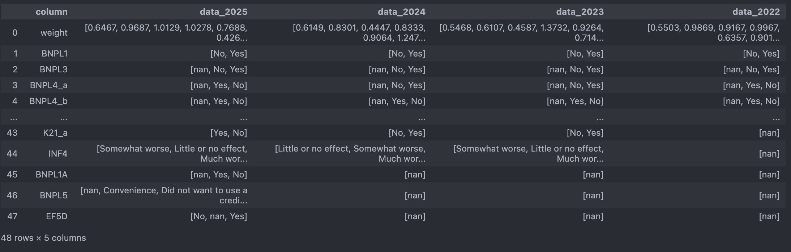

## Dimensionality Reduction - PCA

### KMO Analysis

The Kaiser-Meyer-Olkin (KMO) Test is a statistical measure used to determine the sampling adequacy of data before conducting a Principal Component Analysis (PCA). It assesses the proportion of variance among the variables that might be common variance. A KMO above 0.6 is typically considered acceptable. A high KMO score confirms that the variables share enough common core information to make PCA a meaningful and effective reduction technique; conversely, a low score warns you that the data is too "noisy" or independent to be clustered into common components.

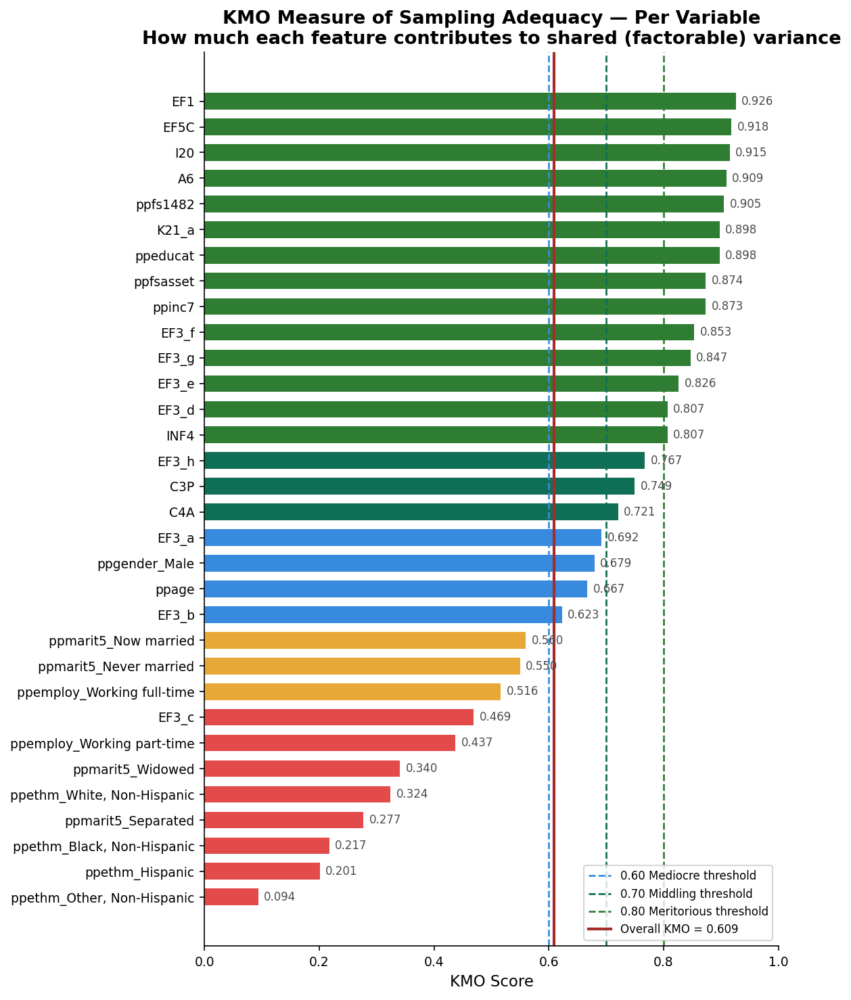{width=600px}

The KMO analysis shows the overall KMO = 0.609 with only 10 variables over 0.85 KMO.

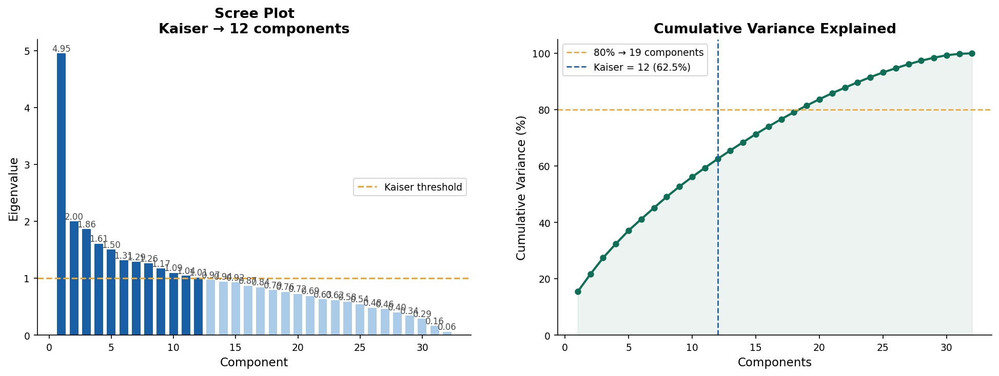{width=600px}

The cumulative variance graph shows that only 12 components have Eigenvalue > 1.0, meaning the principal component explains more variance than a single original variable. However, the cumulative explained variance of 12 components is only 62.5%. In order to explain the variance for 80%, 19 components are needed which is more than half of the total predictive variables. This is a sign that PCA does not meaningfully reduce the dimensionality, likely due to the independence of each survey questions with not much overlapping information. We are going to skip the PCA and instead introduce L1/L2 penalty to reduce the model complexity in order to avoid overfit.

## Modeling

### LASSO Logistic Regression

LASSO logistic regression was chosen as the baseline model for its built-in feature selection — the L1 penalty shrinks uninformative variable coefficients to exactly zero, producing an interpretable model while handling the multicollinearity identified during preprocessing.

**Preprocessing** dropped columns with >50% missing values, applied ordinal encoding to scaled survey responses, one-hot encoded nominal categories, and filled remaining missing values with the column mode. Features were standardised so coefficients are directly comparable. To address the class imbalance (13.3% BNPL adopters, 20.2% delinquency rate among users), `class_weight='balanced'` was applied alongside survey sample weights during fitting.

```{python}
#| eval: false
#| column: page
# Data types encoding
def encode(data):
    for col, m in ordinal_maps.items():
        if col in d.columns:
            d[col] = d[col].map(m)
    for c in binary_cols:
        d[c] = d[c].map({"Yes":1,"No":0})
    d = pd.get_dummies(d, columns=nominal_cols, drop_first=True, dtype=float)
    return d
```

**Hyperparameter tuning** used `LogisticRegressionCV` to search 20 values of regularization strength `C`, selected via 5-fold stratified cross-validation optimising AUC-ROC. Two models were trained: one on the full 2022–2025 dataset and one on 2025 only, the latter including an additional financial stress variable (`EF5D`) available only in the latest survey wave.

```{python}
#| eval: false
#| column: page
# Lasso regression fit
def fit_lasso(X, y, weights, label):
    cv    = StratifiedKFold(n_splits=5, shuffle=True, random_state=42)
    model = LogisticRegressionCV(
        Cs=20, cv=cv, penalty="l1", solver="liblinear",
        class_weight='balanced',
        scoring="roc_auc", max_iter=1000, random_state=42
    )
    model.fit(X, y, sample_weight=weights)
```

**Results**

```{python}
#| eval: false
#| column: page
# Lasso model accuracy scores
m_adopt_A, auc_a1, f1_a1 = fit_lasso(X_A,  y1_A, w1_A, "Adoption — Full 2022-2025")
m_adopt_B, auc_b1, f1_b1 = fit_lasso(X_B,  y1_B, w1_B, "Adoption — 2025 only")
```

| | Adoption Full | Adoption 2025 | Delinquency Full | Delinquency 2025 |
|---|---|---|---|---|
| AUC | 0.767 | 0.787 | 0.791 | 0.805 |
| F1 | 0.402 | 0.453 | 0.533 | 0.592 |
| Recall "Yes" | 0.707 | 0.722 | 0.736 | 0.771 |

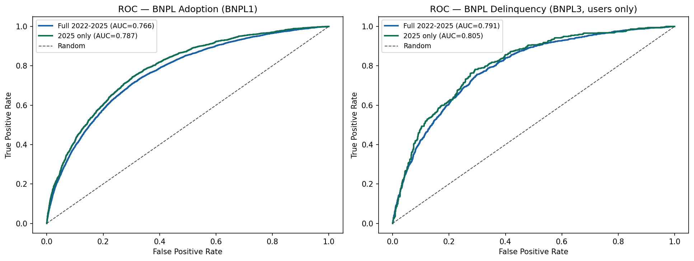{width=800px}

**Feature Coefficients**

Credit card revolving behavior (C4A, +0.44) and spending exceeding income (I20) are the strongest predictors of BNPL adoption across both models — pointing to BNPL as a credit substitute for people already financially stretched. Financial confidence (A6) and age consistently show the largest negative coefficients, meaning older and more financially confident respondents are least likely to adopt or default. Emergency fund availability (EF5C, –0.40) is the top delinquency protector in 2025, while EF5D — a newly added affordability stress variable — emerges as the strongest delinquency risk signal (+0.28), appearing only in the 2025 model. Hardship indicators (EF3_b/d/e/f/h) carry positive coefficients throughout, confirming BNPL adoption is concentrated among respondents under acute financial pressure rather than those seeking payment convenience.


<div style="display: grid; grid-template-columns: 1fr 1fr; gap: 16px; margin: 2rem 0;">

  <figure style="margin: 0;">
    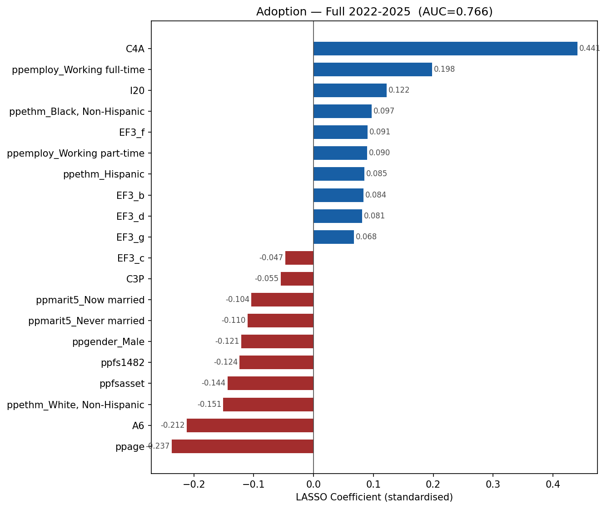
  </figure>

  <figure style="margin: 0;">
    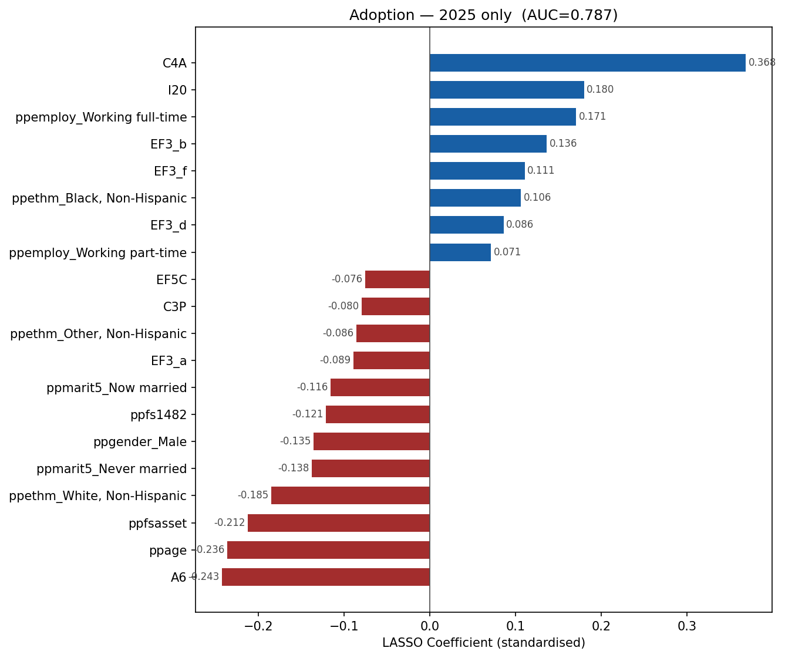
  </figure>

  <figure style="margin: 0;">
    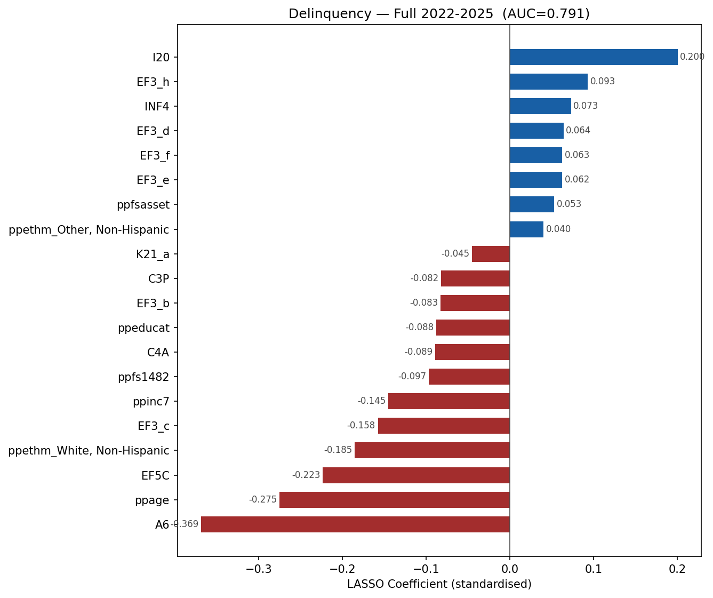
  </figure>

  <figure style="margin: 0;">
    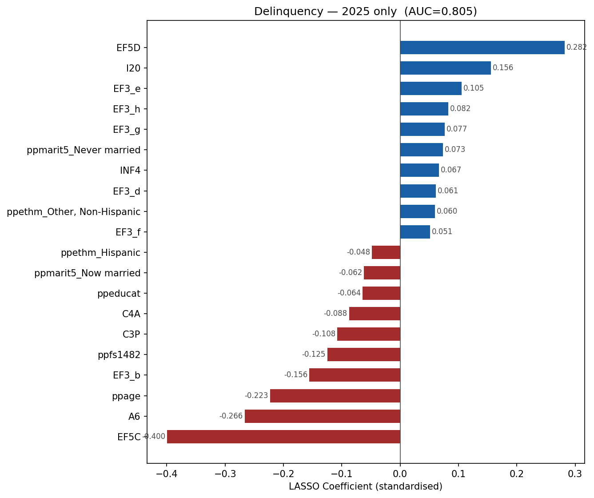
  </figure>

</div>

<p style="font-size: 0.85rem; color: #666; text-align: center; margin-top: 4px;">
  Blue = increases BNPL probability &nbsp;|&nbsp; Red = decreases BNPL probability &nbsp;|&nbsp;
  Coefficients on standardised features
</p>

## Linear SVC

Linear Support Vector Classification (LinearSVC) was selected as the second model for its different optimization objective. LinearSVC maximizes the margin between classes, drawing the decision boundary as far as possible from both the BNPL user and non-user clusters. The same preprocessing pipeline was applied: columns with >50% missing values were dropped, remaining missing values were mode-imputed, and all features were standardised. Since LinearSVC does not natively output probabilities, `CalibratedClassifierCV` with 3-fold sigmoid calibration was applied as a wrapper to enable AUC evaluation. Hyperparameter tuning searched over C ∈ {0.001, 0.01, 0.1, 0.5, 1, 5, 10} via 5-fold stratified cross-validation optimising AUC-ROC, with `class_weight='balanced'` and survey sample weights applied throughout.

```{python}
#| eval: false
#| column: page
# Non-linear SVC model accuracy scores
model = GridSearchCV(
    CalibratedClassifierCV(
        LinearSVC(class_weight='balanced', max_iter=5000, random_state=42),
        cv=3, method='sigmoid'
    ),
    param_grid={'estimator__C': [0.001, 0.01, 0.1, 0.5, 1, 5, 10]},
    cv=cv, scoring='roc_auc', n_jobs=-1
)
```

**Results**

| | Adoption Full | Adoption 2025 | Delinquency Full | Delinquency 2025 |
|---|---|---|---|---|
| AUC | 0.766 | 0.786 | 0.791 | 0.805 |

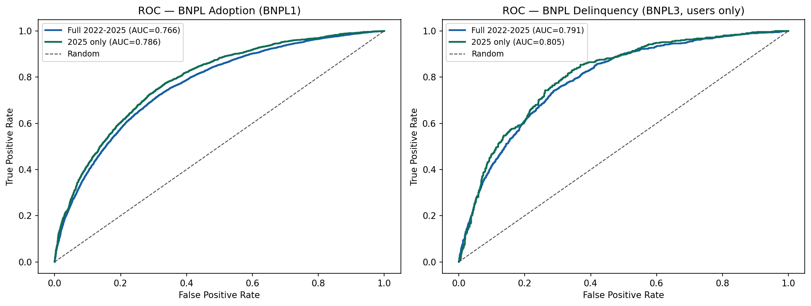{width=800px}

AUC scores are nearly identical to LASSO across all four models, confirming that both linear approaches capture a similar discriminative ceiling on this dataset. The 2025 model again outperforms the full-period model, consistent with the LASSO finding.

```{python}
#| eval: false
#| column: page
# Non-linear SVC model coefficients

coefs = pd.Series(
    np.mean([clf.estimator.coef_[0]
             for clf in model.calibrated_classifiers_], axis=0),
    index=features
)
```
**Coefficients vs LASSO**

The ranking of top features is highly consistent with LASSO, validating the robustness of the signal. `C4A` (credit card revolving, +0.18 full, +0.15 in 2025) remains the dominant adoption predictor, and `A6` (financial confidence, –0.09/–0.14) and `ppage` (age, –0.10) are again the strongest protective factors in every model. `I20` (spending exceeding income) ranks as the top delinquency risk factor in the full model (+0.077), while `EF5D` takes over in 2025 (+0.117) — mirroring LASSO exactly.

The key difference from LASSO is in coefficient scale and the delinquency direction of `C4A`. In LASSO, `C4A` carried a negative delinquency coefficient (–0.088), suggesting revolvers who adopt BNPL actually manage repayments — possibly because they are experienced credit users. LinearSVC flips this to negative (–0.036) with a smaller magnitude, reflecting that the margin-based boundary weights this variable differently when optimizing for separation rather than probability. This divergence is worth noting: it suggests `C4A`'s relationship with delinquency is non-linear and context-dependent, something neither linear model fully captures — motivating the XGBoost analysis that follows.

<div style="display: grid; grid-template-columns: 1fr 1fr; gap: 16px; margin: 2rem 0;">

  <figure style="margin: 0;">
    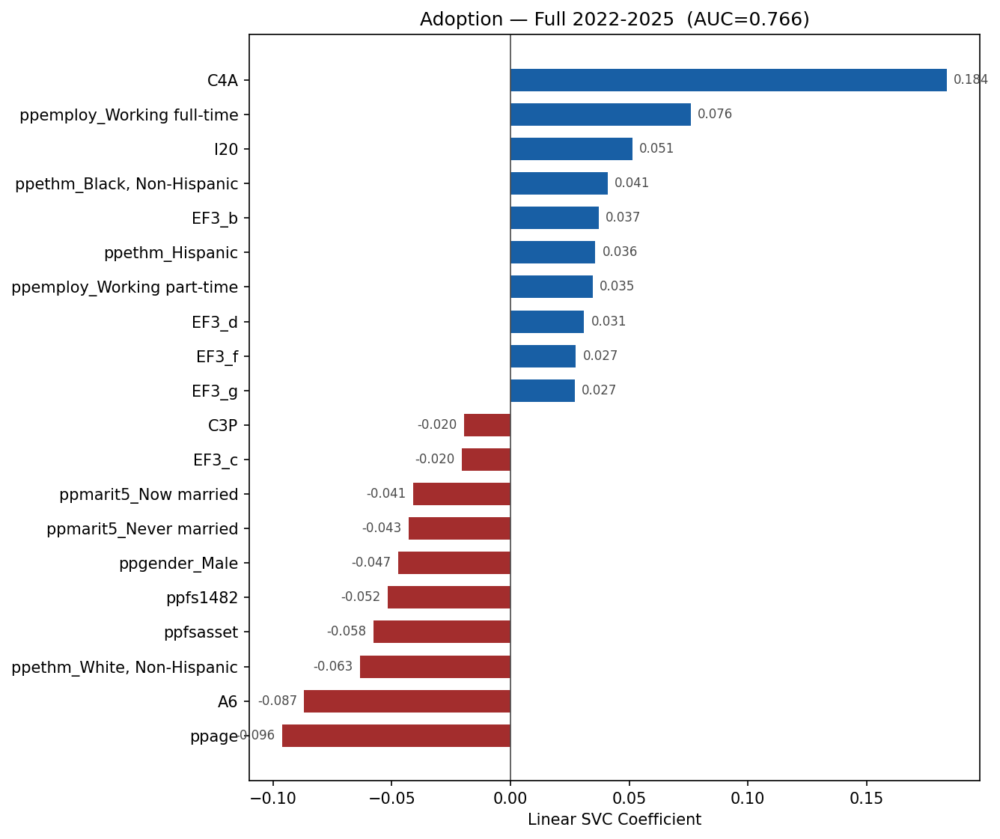
  </figure>

  <figure style="margin: 0;">
    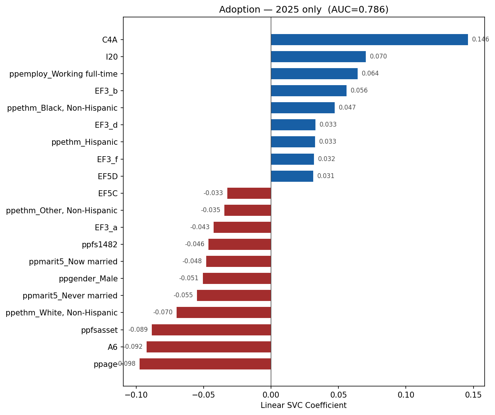
  </figure>

  <figure style="margin: 0;">
    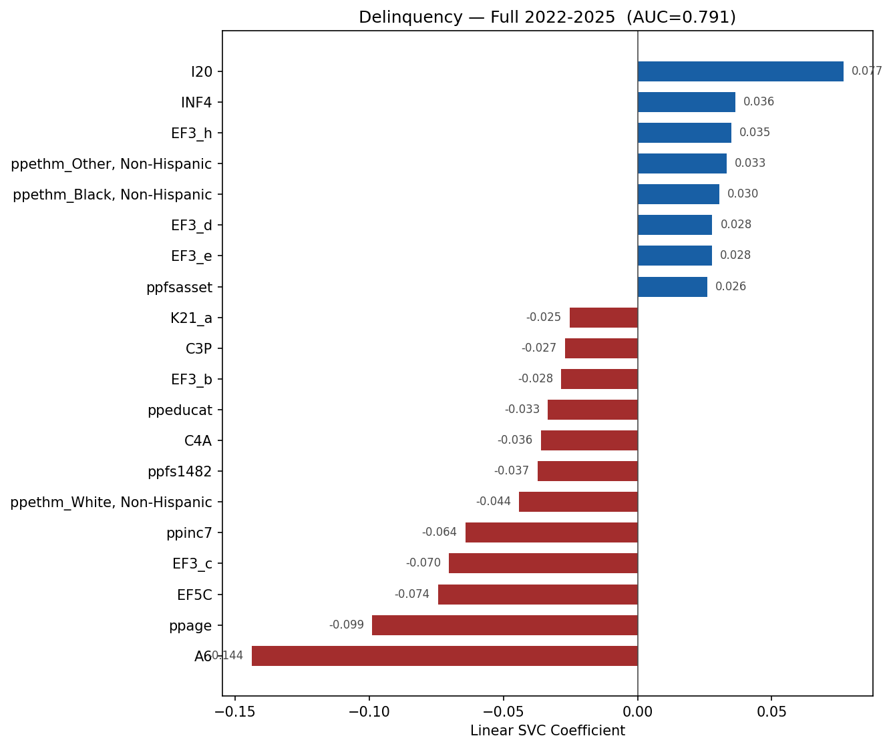
  </figure>

  <figure style="margin: 0;">
    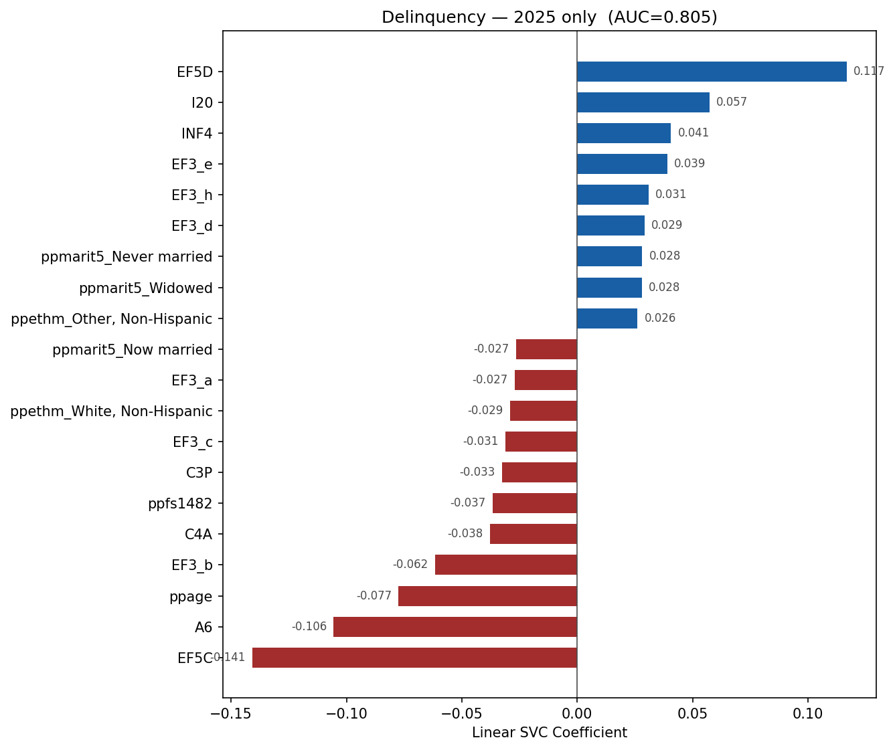
  </figure>

</div>

<p style="font-size: 0.85rem; color: #666; text-align: center; margin-top: 4px;">
  Blue = increases BNPL probability &nbsp;|&nbsp; Red = decreases BNPL probability &nbsp;|&nbsp;
  Coefficients on standardised features
</p>

### Non-Linear SVC

Kernel SVC with RBF was tested as a non-linear alternative, searching over C ∈ {0.1, 1, 10} and gamma ∈ {scale, 0.01, 0.1} via 5-fold cross-validation. Despite achieving reasonable AUC scores (0.68–0.83), the model collapsed recall on the minority class to near zero for adoption — predicting almost all observations as "No" — making it unsuitable for this task. This is a known limitation of kernel SVC under severe class imbalance: the radial basis function optimizes a smooth margin that gets dominated by the majority class geometry, and class_weight='balanced' is less effective at correcting this than in linear models. Combined with O(n²) training complexity making it impractical at N=48,294, kernel SVC was excluded from the final model comparison.

### XGBoost

XGBoost was selected as the final model to capture non-linear interactions and threshold effects that linear models cannot. Unlike LASSO and LinearSVC, XGBoost handles missing values natively — allowing the split-ballot columns (`L0C`, `A1_a/b/c`, `X12_a–g`, `EF5D`) to be included in the full feature set without imputation. No feature scaling was applied. Class imbalance was handled via `scale_pos_weight` (the negative-to-positive ratio: 6.5 for adoption, 4.0 for delinquency). Hyperparameter tuning searched over `max_depth` ∈ {3, 5}, `learning_rate` ∈ {0.05, 0.1}, and `n_estimators` ∈ {100, 200} via 5-fold stratified cross-validation optimising AUC-ROC.

```{python}
#| eval: false
#| column: page
# XGBoost model

scale_pos_weight = (y==0).sum() / (y==1).sum()  # ~6.5 adoption, ~4.0 delinquency

XGBClassifier(
    scale_pos_weight=scale_pos_weight,
    eval_metric='auc',
    random_state=42
)
```

**Results**

| | Adoption Full | Adoption 2025 | Delinquency Full | Delinquency 2025 |
|---|---|---|---|---|
| AUC | 0.812 | 0.831 | 0.839 | 0.868 |
| Recall "Yes" | — | — | 0.249 | 0.839 |

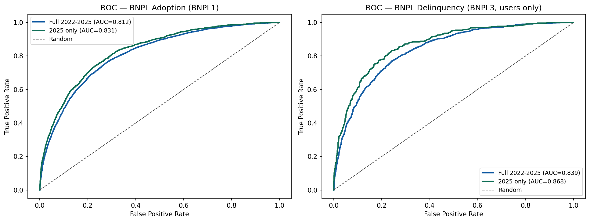{width=800px}

XGBoost outperforms both LASSO (AUC 0.767/0.787) and LinearSVC (AUC 0.766/0.786) across all four models, with the largest gains on delinquency — AUC of 0.868 in 2025 vs 0.805 for both linear models. The delinquency 2025 model achieves recall of 0.839 on defaulters, a substantial improvement over the ~0.40 ceiling of the linear models, confirming that delinquency risk is driven by non-linear interactions between financial stress indicators.

**SHAP Analysis**

<div style="display: grid; grid-template-columns: 1fr 1fr; gap: 16px; margin: 2rem 0;">

  <figure style="margin: 0;">
    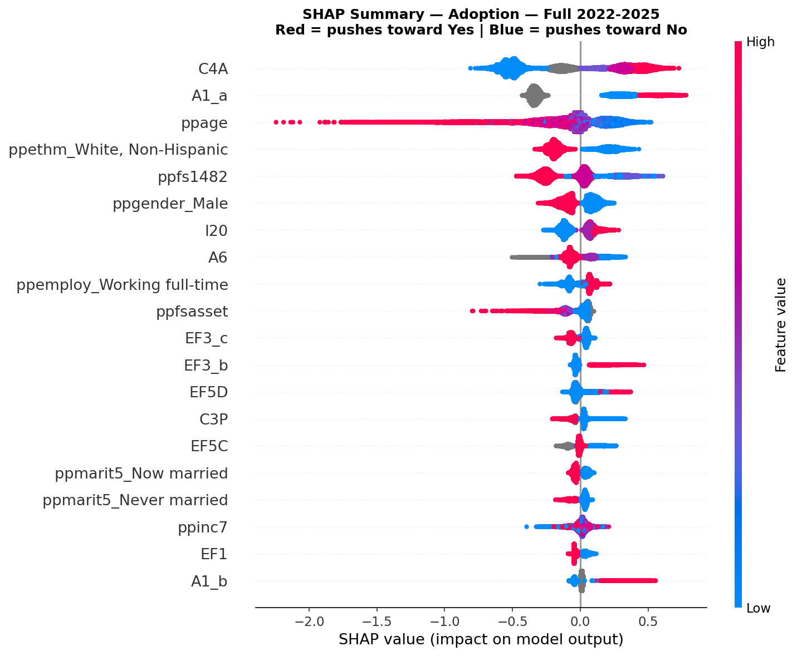
  </figure>

  <figure style="margin: 0;">
    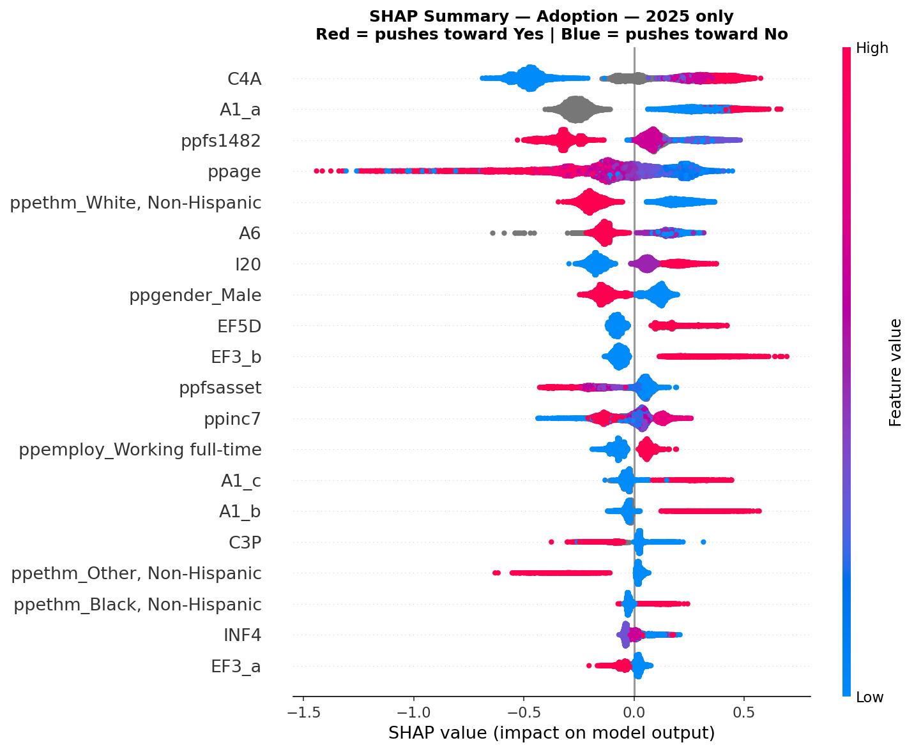
  </figure>

  <figure style="margin: 0;">
    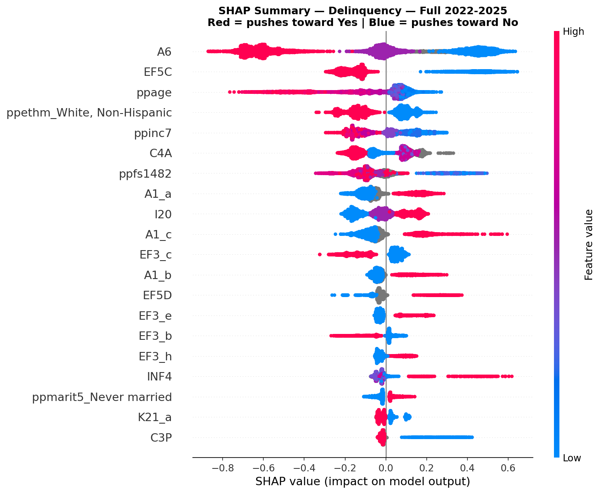
  </figure>

  <figure style="margin: 0;">
    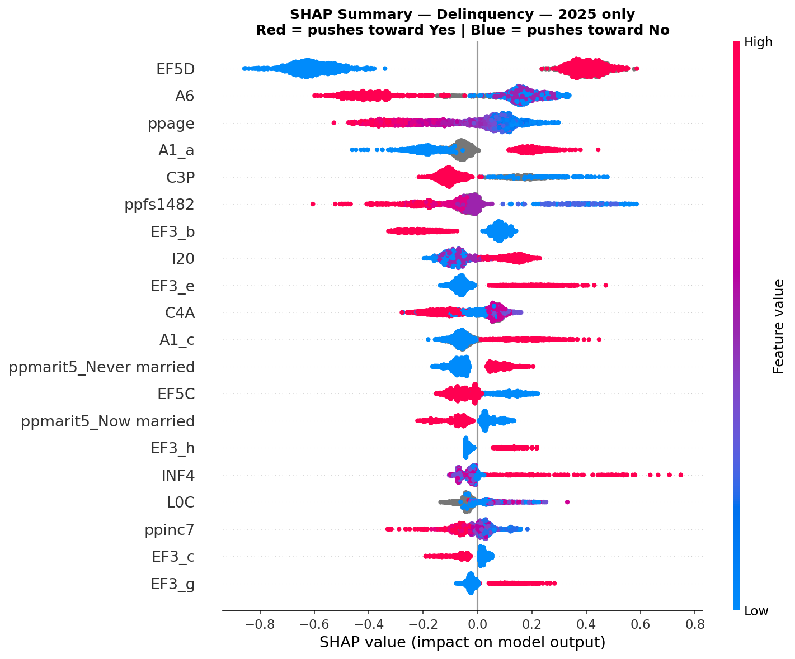
  </figure>

</div>

<p style="font-size: 0.85rem; color: #666; text-align: center; margin-top: 4px;">
  Blue = increases BNPL probability &nbsp;|&nbsp; Red = decreases BNPL probability &nbsp;|&nbsp;
  Coefficients on standardised features
</p>

SHAP values reveal both importance and direction, offering richer insight than coefficients alone. For adoption, `C4A` (credit card revolving) remains the top feature across both models — consistent with LASSO and LinearSVC — but the beeswarm plot shows XGBoost captures a non-linear threshold: the SHAP impact jumps sharply for the highest revolving category rather than increasing linearly. `A1_a` (credit card application outcomes) emerges as the second most important feature in both adoption models, a variable unavailable to LASSO due to >50% missingness — validating the benefit of XGBoost's native NA handling. `ppage` shows strongly negative SHAP values concentrated at young ages (red dots on the far left), confirming age has a non-linear protective effect that strengthens below ~30.

For delinquency, `A6` (financial confidence) is the dominant feature in the full model (mean |SHAP| = 0.40), with the beeswarm showing high confidence (blue) pushing strongly toward no-delinquency and low confidence (red) spreading across a wide range of positive SHAP values. In the 2025 model, `EF5D` takes over as the single strongest predictor (mean |SHAP| = 0.51) — with a clear split: high `EF5D` (red) drives large positive SHAP values toward delinquency, and low `EF5D` (blue) clusters near zero. This non-linear threshold behavior is invisible to linear models and explains why XGBoost gains the most on the 2025 delinquency task specifically.

```{python}
#| eval: false
#| column: page
# SHAP Analysis

explainer   = shap.TreeExplainer(model)
shap_values = explainer.shap_values(X)

# Beeswarm: magnitude + direction per observation
shap.summary_plot(shap_values, X, feature_names=feat_cols, plot_type="dot")
```

## Cnclusion

XGBoost delivers the strongest performance across all four tasks (adoption AUC 0.812/0.831, delinquency AUC 0.839/0.868), with delinquency recall of 0.839 in the 2025 model — identifying 84% of actual defaulters, well beyond what the linear models could achieve. The gains come from its ability to capture non-linear threshold effects and its native handling of missing values, which unlocks split-ballot survey variables unavailable to other models.

Key predictive signals: Credit card revolving behavior (C4A) is the strongest adoption predictor across all models — BNPL is used as a credit substitute, not a convenience. Financial confidence (A6) and age are the top protective factors for both adoption and delinquency. For delinquency specifically, emergency fund availability (EF5C) is the clearest buffer, while EF5D — a 2025-only variable measuring difficulty affording basic expenses — emerges as the single strongest delinquency signal (SHAP mean |value| = 0.51), with a non-linear threshold effect only XGBoost could capture. Acute affordability stress is now a better early warning for BNPL default than any longer-standing financial health measure.

## References

Abordamos brevemente o conceito de cointegração de séries temporais no sentido de Engle-Granger. Há vários buracos deixados ao longo do texto que precisam de mais espaço e conhecimentos prévios para serem preenchidos. Espero poder abordar outros desses tópicos sobre séries temporais adiante, mas por enquanto aproveite para conferir abaixo os trabalhos citados.

Engle, R. F., & Granger, C. W. (1987). *Co-integration and error correction: representation, estimation, and testing*. Econometrica: journal of the Econometric Society, 251-276.

MacKinnon, J. G. (1991). *Critical values for cointegration tests*, Ch. 13 in Long-run Economic Relationships: Readings in Cointegration, eds. R. F. Engle and C. W. J. Granger, Oxford, Oxford University Press.

Murray, M. P. (1994). *A drunk and her dog: an illustration of cointegration and error correction*. The American Statistician, 48(1), 37-39.
